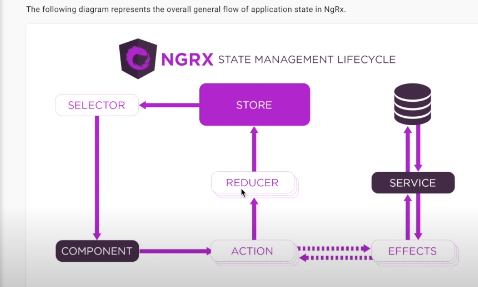

# Criando projeto para consultar a previsao do tempo via API 

- https://openweathermap.org/
- salvei minha api key 
- salvei a base do projeto 
- npm i 

## parte 2 
mostrou a aplicação 
## parte 3 
- mostrou como editar o tslint.json para  permite criar componentes com sufixo de pagina  ajuda na separacao por nomeclatura das responsabilidades

  "component-class-suffix": [
      true,
      "Component", /// permite criar componentes com sufixo de pagina  ajuda na separacao por nomeclatura das responsabilidades
      "Page"
    ],

- dai adicionaou um modulo dentro de pages/home 

    ng g m pages/home 

  - dai adicionaou um modulo dentro de pages/bookmarks 

    ng g m pages/bookmarks

  - dai adicionaou um componente dentro de pages/home  com typo pagina 

    ng g c pages/home --type page 

    dai sera criado home.page. 


  ng g c pages/bookmarks --type page 

    dai sera criado bookmark.page. 

 - vamos renderiza-los 

 app routing 

 - craimos nova rota 

 ``` Js 
 import { NgModule } from '@angular/core';
import { Routes, RouterModule } from '@angular/router';
import { HomePage } from './pages/home/containers/home/home.page';
import { BookmarksPage } from './pages/bookmarks/containers/bookmarks/bookmarks.page';

const routes: Routes = [
  { path: '', component: HomePage },
  { path: 'bookmarks', component: BookmarksPage },
  { path: 'details', loadChildren: () => import('./pages/details/details.module').then(m => m.DetailsModule) },
];

@NgModule({
  imports: [RouterModule.forRoot(routes)],
  exports: [RouterModule]
})
export class AppRoutingModule { }

 ```   
## aula 4 
NGRX é o redux , dispacha acções para mudança da store quando há mudanças para angular 

 


um componente despacha ações que passam por um reducer e atualiza-se a store (um Json que guarda o estado da aplicação ) , teremos múltiplos reducers cada um lidando com ações diferentes . Reducer é uma função pura que retorna sempre um novo estado. 

- effects são side efeccts de uma action geralmente usados para realizar chamadas de serviço 
- Observable , daremos subscribe 

- ng add @ngrx/store  (adiciona o ngrx )

- importamos o storeModeule no app module 

```JS
 StoreModule.forRoot(reducers), /// inicializado o json 
```

- importamos no home o storemodule só que agora forfeature 

```JS 
    StoreModule.forFeature('home', homeReducer),
    EffectsModule.forFeature([HomeEffects]),
    ComponentsModule,
```
- declaramos a interface dentro do state 

src\app\pages\home\state\home.reducer.ts

- pelo dev tools vamos visualizar  o estado da store e as actions disparadas 

- ng add @ngrx/store-devtools 

- fará o bind entre o store da aplicação e o chrome (redux devtools)

- criamos o home.actions que define as ações 

- uma ação é despachada pelo pacote que manipula a store é capturada pelo reducer e dependendo do tipo faz manipulações na store 

-as actions aceitam props 

- entre [] o nome da feature que dispara a ação 

## parte 6 
effects 

iguais ao reducer , reagem as action de forma assincrona usando observables 

ng add @ngrx/effects 

effects module

EffectsModule.forRoot([]),

effect é um serviço injectable 

deve ser declarado no module 

queremos declara-lo separado por feature (dentro de home)

EffectsModule.forFeature([HomeEffects]),


  constructor(private actions$: Actions,
              private store: Store,
              private weatherService: WeatherService) {
  }
  /// action eh uma string de dados 
 
  /// colocamos o $ pois eh um observable 

``` Js 
loadCurrentWeather$ = createEffect(() => this.actions$ /// $ para dizer que é observable 
     .pipe( /// filtro 
      ofType(fromHomeActions.loadCurrentWeather),  
      mergeMap(({ query }) => this.weatherService. getCityWeatherByQuery(query)),
      catchError((err, caught$) => {
        this.store.dispatch(fromHomeActions.loadCurrentWeatherFailed());
        return caught$;
      }),
      map((entity: CityWeather) => fromHomeActions.loadCurrentWeatherSuccess({ entity })),
    ),
  );
```

## parte 7 

vamos criar as actions que o projeto usa 

home reducers.ts 

vamos criar os servicos dentro de shared services weather --skipTests True 

## parte 8 

- escrevemos os selectors 

- teremos tres observables que realizaremos o subscribe, cityweather que retorna as informações carregadas da previsão do tempo da cidade, um loading que diz se está carregando ou nao (bool) e um error que e também eh um boleano 

- quando usamos um observable em html temos que usar um pipe async 
 
``` HTML
<jv-loader *ngIf="loading$ | async"></jv-loader>

  <div *ngIf="!(loading$ | async) && !(error$ | async) && !!cityWeather">
    <jv-current-weather [cityWeather]="cityWeather"
                        [isFavorite]="isCurrentFavorite$ | async"
                        [unit]="unit$ | async"
                        (toggleBookmark)="onToggleBookmark()"></jv-current-weather>
  </div>

  <div *ngIf="!(loading$ | async) && error$ | async">
    <a>Tentar novamente</a>
  </div>

```

- no devtools podemos fazer timetravel 

o container recebe as informações dos filhos  home (feature folder) conteiners ( no momento só tenho a home se vc tem algo que só serve para uma feature específica coloque dentro do container )


- usamos o change detection para evitar que os metodos sejam carregadas a cada clock do html , a view será atualizada  ( o change detecton)  sempre que um dos inputs mudar 

ou seja o get só sera realizado quando hovuer mudança nos inputs 

``` JS 
import { Component, Input, Output, ChangeDetectionStrategy, EventEmitter } from '@angular/core';

import { CityWeather } from '../../../../shared/models/weather.model';
import { Units } from 'src/app/shared/models/units.enum';

@Component({
  selector: 'jv-current-weather',
  templateUrl: './current-weather.component.html',
  styleUrls: ['./current-weather.component.scss'],
  changeDetection: ChangeDetectionStrategy.OnPush,
})
export class CurrentWeatherComponent {

  @Input() cityWeather: CityWeather;
  @Input() isFavorite: boolean;
  @Input() unit: Units;
  @Output() toggleBookmark = new EventEmitter();

  get cityName(): string {
    return `${this.cityWeather.city.name}, ${this.cityWeather.city.country}`; 
  }

  onToggleBookmark() {
    this.toggleBookmark.emit();
  }
}

```

temos que dar subscribe nos observables !! 

``` JS 
 this.cityWeather$ = this.store.pipe(select(fromHomeSelectors.selectCurrentWeather));
    this.cityWeather$
      .pipe(takeUntil(this.componentDestroyed$))
      .subscribe(value => this.cityWeather = value);
```


## Parte 9 


- criando o estado do bookmarks que será alterado pelo home 


### PArte 10 


routerguard : vamos colocar uma condição na rota, o componente só será renderizado se passar por esta condição 

``` JS 
import { Injectable } from '@angular/core';
import { CanActivate, Router, ActivatedRouteSnapshot, RouterStateSnapshot, UrlTree } from '@angular/router';

@Injectable()
export class DetailsGuard implements CanActivate {

  constructor(private router: Router) {
  }

  canActivate(route: ActivatedRouteSnapshot, state: RouterStateSnapshot): boolean | UrlTree {
    if (route.queryParams.lat && route.queryParams.lon) {
      return true;
    }
    return this.router.createUrlTree(['']);
  }
}

```

Vamos usar o router store que coloca o estado da rota na store 

- ng add @ngrx/router-store 

- vamos construir um custom serializer para construir um estado mimificado só com as informações utilizadas 

## parte 11 

Criamos um router state customizado só colocar no estado as informações que queremos ( lon e lat )

``` JS
import { Params, RouterStateSnapshot } from '@angular/router';

import { RouterStateSerializer } from '@ngrx/router-store';

export interface RouterState {
  url: string;
  params: Params;
  queryParams: Params;
  fragment: string;
}

export class CustomRouterSerializer implements RouterStateSerializer<RouterState> {
  serialize(routerState: RouterStateSnapshot): RouterState {
    const { url } = routerState;
    const { queryParams } = routerState.root;
    const { fragment } = routerState.root;

    let route = routerState.root;
    const params: Params = {};
    do {
      if (!!route.params) {
        Object.keys(route.params).forEach(key => {
          params[key] = route.params[key];
        });
      }
      route = route.firstChild;
    } while (!!route);

    return { url, params, queryParams, fragment };
  }
}

```

### parte 12 

- typeadhead 

- Pesquisa com sugestão (bootstrap)

- ex: itera por todas as cidades e sugere uma cidade 

- ng add ngx-bootstrap 
 
 - criamos o componente citiestypeahead 

 - vamos usar um componente em um componente do tipo formulario do angular controlValue accessor

registerOnchange 

registeron touched 

set disabled state 

write value 
 

### aula 13 

melhorando o city typeahdead para mostrar o pais 

melhorando o template do typeahdera 


### aula 14 

selector 

renderizacao dinamica ( portais ) home page vai ternderizar uma informação no app component 

common behaviores do angular materials 

partais ( de outro componente renderizamos outro componente )

ng add @angular/cdk 

- criamos um novo componentent que vamos usar para determinar as unidades de medida da temperatura 

ng c s pages/home/containers/unit-selector

```JS 
<div>
  <span>Unidade:</span>
  <ul class="list-inline">
    <li class="list-inline-item" (click)="updateUnit(unitsEnum.Metric)">
      <a class="badge" [ngClass]="unit === unitsEnum.Metric ? 'badge-primary' : 'badge-dark'">˚C</a>
    </li>
    <li class="list-inline-item" (click)="updateUnit(unitsEnum.Imperial)">
      <a class="badge" [ngClass]="(unit$ | async) === unitsEnum.Imperial ? 'badge-primary' : 'badge-dark'">˚F</a>
    </li>
    <li class="list-inline-item" (click)="updateUnit(unitsEnum.SI)">
      <a class="badge" [ngClass]="(unit$ | async) === unitsEnum.SI ? 'badge-primary' : 'badge-dark'">K</a>
    </li>
  </ul>
</div>
```

- criou também um estado para configuração a nivel global 

``` JS 
import { createReducer, on } from '@ngrx/store';

import { Units } from '../../models/units.enum';
import * as fromConfigActions from './config.actions';

export interface ConfigState {
  unit: Units;
}

export const configInitialState: ConfigState = {
  unit: Units.Metric,
}

export const configReducer = createReducer(
  configInitialState,
  on(fromConfigActions.updateUnit, (state, { unit }) => ({
    ...state,
    unit,
  })),
);

```
vamos colocar isso na request 


